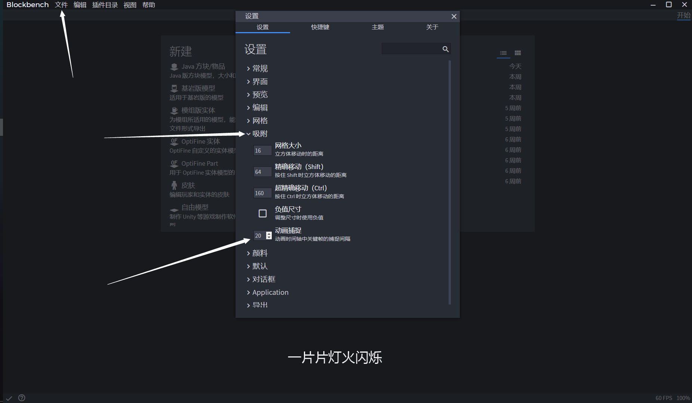
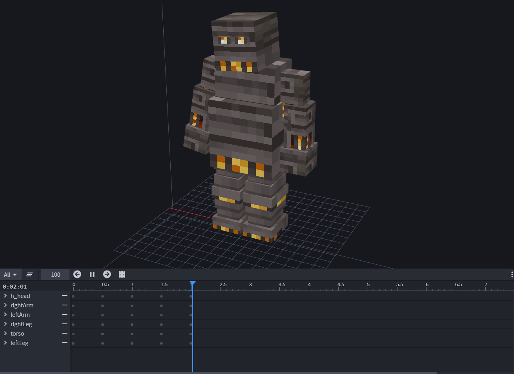
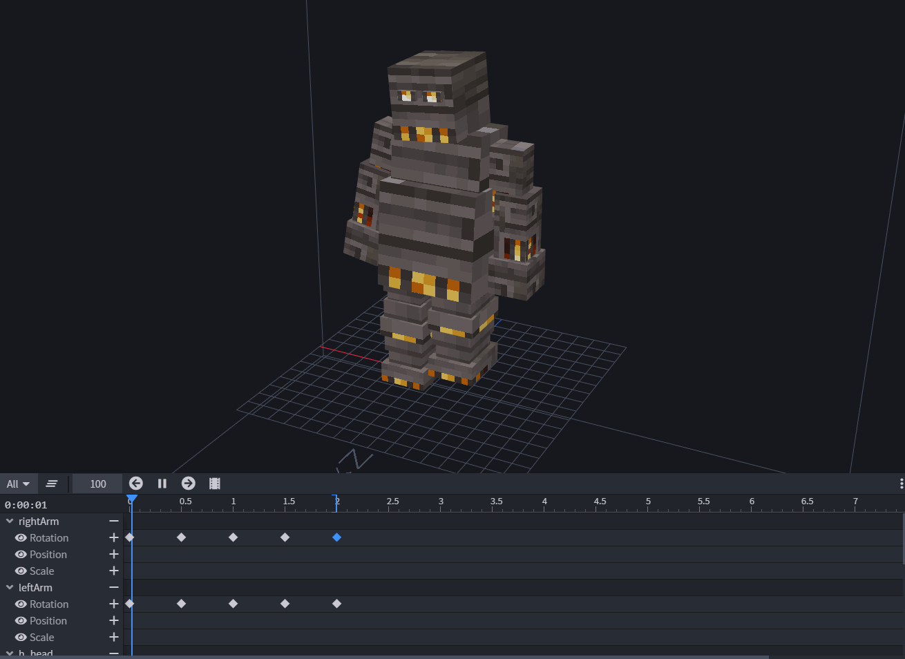
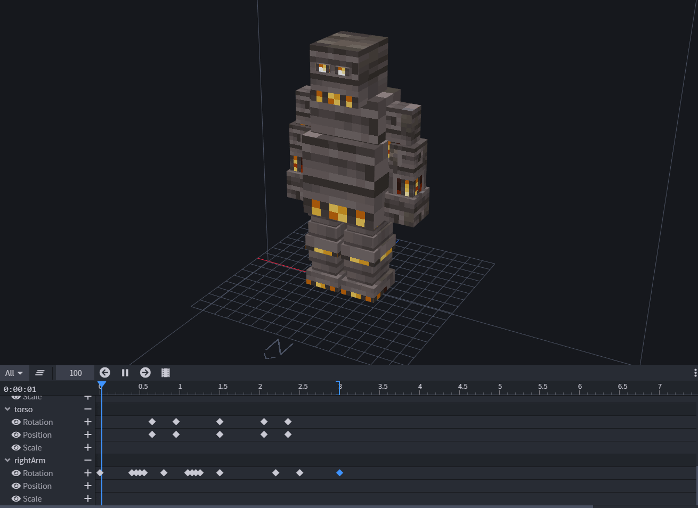

# 基岩模型动画

## 动画

做好模型后，剩下的是设计动画，为给各种状态设计不同的动画，例如空闲状态的动画，行走状态的动画，攻击状态的动画

## 状态与优先级

### 状态

让我们从基础开始。在模型引擎中，模型会根据不同状态而显示不同的动画

每个模型可以拥有多个状态

每个模型还可以一次拥有多个状态，比如同时进行行走和攻击，这样不需要创建唯一动画，而是多个动画结合起来

### 优先级

每个状态都具有优先级。优先级越低，应用其模型动画越早，意味着它与优先级较高的状态相比，对模型影响较少

如下，attack状态的动画比idle状态更明显

## 循环与覆盖

右键会显示这些选项

### 循环

使用为Loop时，动画会无限循环运行，直到移除状态为止

不使用Loop时，动画只会运行一次，并且将其状态删除

### 覆盖

覆盖意味着取消优先级比其低的动画。此选择是在模型具有多个状态时会应用到，不希望attack状态被其它低级状态动画影响，不结合低级状态动画使用

## 动画制作

在BlockBench制作基岩模型动画十分简单，但请注意

* Usable Timelines（翻译能力有限）
  * Only `Position` and `Rotation` timeline can be used when animating. Model Engine will ignore any changes in `Scale` timeline, as it is impossible to scale in Minecraft without using a lot more resources.
* Usable Bones（翻译能力有限）
  * You can animate all bones except `hitbox` and `effect`. `hitbox` bone will be ignored by Model Engine as it is removed as soon as it is loaded, while `effect` bone is still under development.
* FPS
  * 由于Minecraft每秒是20tick，因此所有动画将以20 tick的速度运行，并且所有关键帧之间的距离必须至少间隔0.05秒
  * 可以通过将“动画捕捉”选项更改为20（位于“文件/吸附/设置/动画捕捉”下）来在BlockBench中设置捕捉选项。然后，时间轴滑块将以0.05的间隔移动

**空闲状态**（循环）

**行走状态**（循环）

**攻击状态**（覆盖）

这三个是基本动画，只需要移动和旋转就完成了

但是，更复杂的动作需要更多帧数来完成流畅的动作

## 导出动画并使用动画

导出动画，命名为 模型ID.animation.json

## 结果

只要有足够的耐心，你一定能做到

