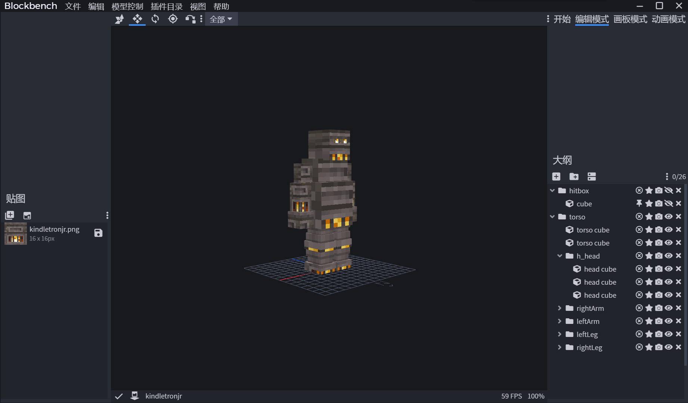
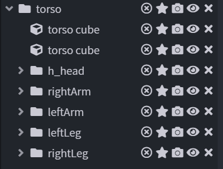
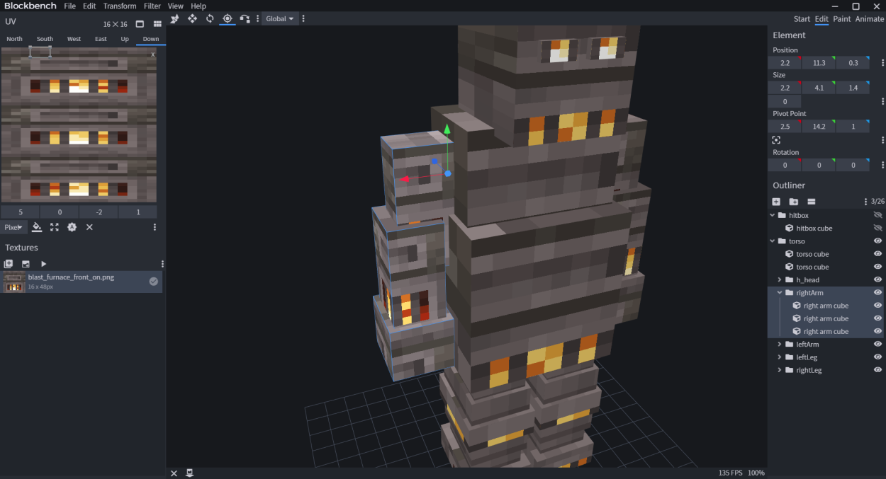
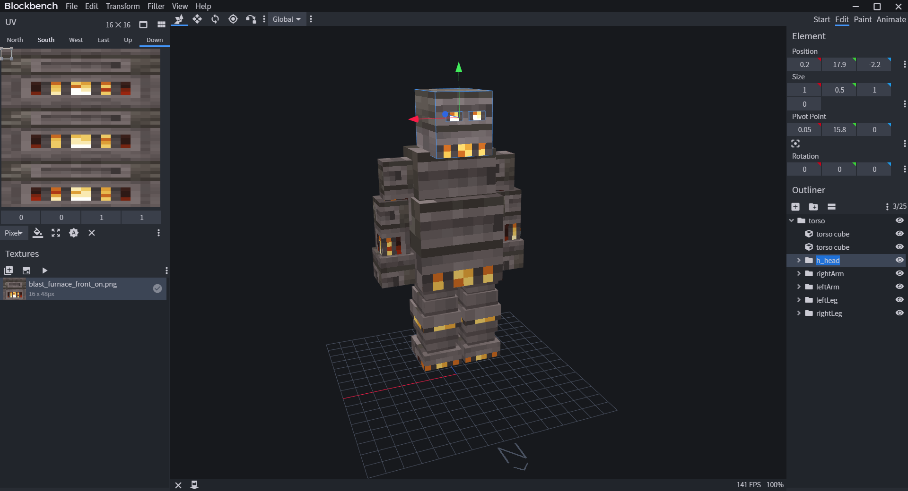
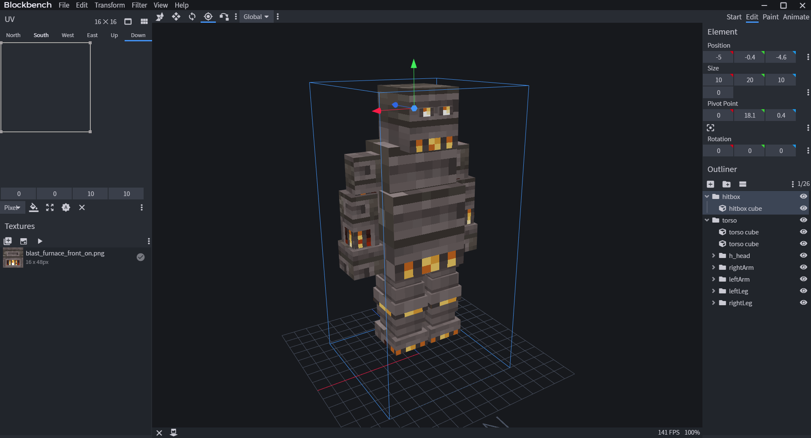
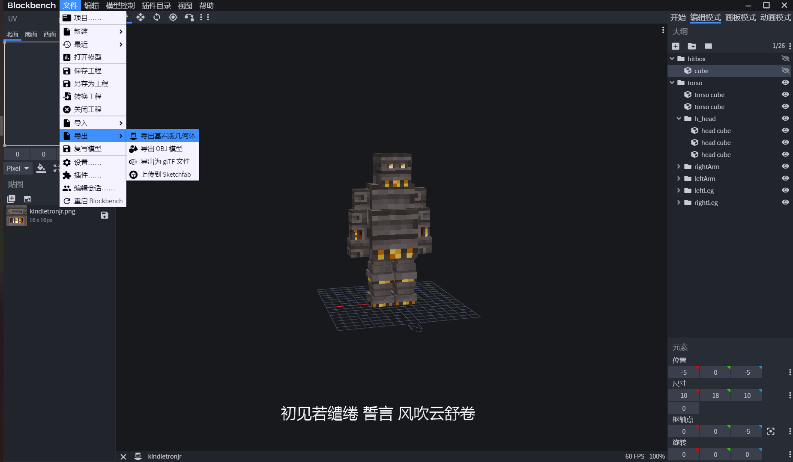
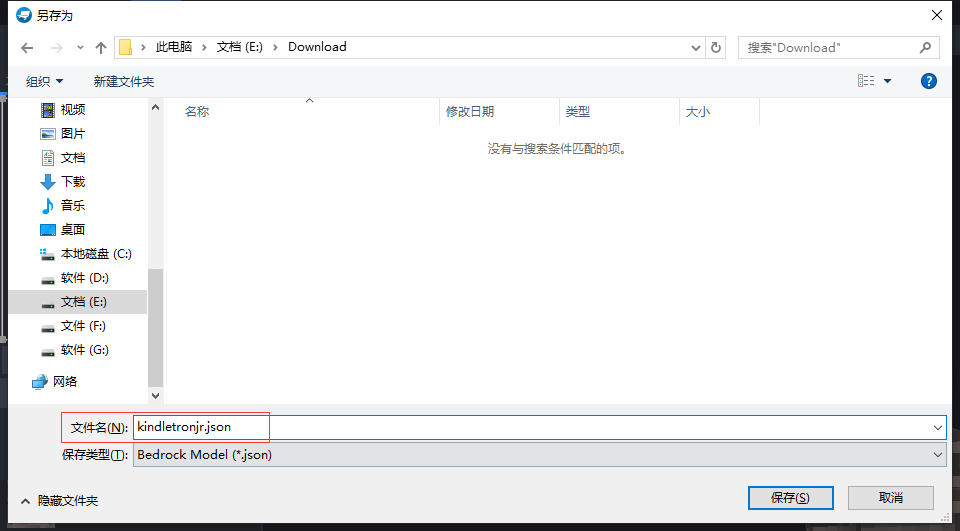

# 制作一个模型

## 创建项目

BlockBench支持制作基岩模型和设置基岩模型的动画，这就是我们想要做的

首先我们创建一个项目，选择 新建基岩版模型

填写文件名，就是模型ID

关闭 盒子UV


在继续建模之前，请了解以下内容


## Bone 和 Cube \| 部件和元素

建模时，要了解 Bone 和 Cube 之间的差异


这里我们将 **Bone** 命名为 **部件** ， **Cube** 命名为 **元素** 吧


部件是元素的集合（多元素组成部件）

模型是部件的集合（多部件组成模型）

一个模型是通过多个盔甲架组成的，每个盔甲架是一个部件，盔甲架包含着物品模型

在BlockBench译文里，**部件**是**组**，**元素**是**立方体**


所以


**元素**要遵循Minecraft物品模型的限制（因为它相当于）：

（事实上，在BlockBench的Java模型设计中能体会到的，在基岩模型设计中不能体会）

* 只能以22.5度增量旋转
* 角度只能在45到-45之间
* 只能在一个轴上旋转
* 不能大于48x48x48

而**部件**受到限制很少（因为它相当于一个盔甲架）：

* 可以自由旋转
* 可以在多个轴上旋转
* 不能大于48x48x48（要大于此尺寸，则使用 [Position父子模型](createmodel.md#position-fu-zi-mo-xing) 方法）

你可以操控部件（元素的集合）直接操控部件模型

由于每个盔甲架是一个部件，则请保持部件和元素的平衡（不要花里胡哨的旋转之类，在后面动画中可以设置），即使要选择，请遵循元素的旋转限制规定（不过在动画不受旋转限制）

让开始开始，创建组，并添加立方体

让我们制作一个简单的模型，看这个KindletronJR


注意，建模时，注意模型脚下的网格，确保模型朝向 N

网格也是Minecraft的地面，如果你希望模型站立在地面，请让脚部接触网格


## Position \| 父子模型

这不是教育孩子之类

在模型引擎中，单独的部件（子部件）可以添加到另一个部件（父部件）中，并且子部件随父部件移动和旋转

torso组是父部件，它所包含的组是子部件（h\_head, rightArm等等）

子部件连接着父部件的元素

## Pivot \| 轴

在BlockBench译文中，就是**枢轴工具**

每个部件都有一个轴。它决定了部件旋转的位置

例如 rightArm部件在旁边的其身体部件旋转，则请将轴放置在身体部件旁边，如图


如果不正确地使用枢轴，那么在游戏中动画处理时会进行错误地旋转


枢轴工具在这里

## Head Rotation \| 头部旋转

当生物看着你时，头部会转向你，而身体静止不动

这样地效果也可以在这个模型引擎中做到

默认情况下，所有部件会随身体旋转

当你希望部件像头部那样旋转，那么你要做的是对这个部件的名称前面添加 **h\_**

一个模型也可以有多个头部，元素头部的名称前面就需要添加 **h\_**

## Hitbox and Head Height \| 打击箱和头部高度

创建模型后，剩下的是为模型分配一个打击箱和头部高度

打击箱也就是我们所说的碰撞箱，具有可被玩家点击和碰撞效果，哪怕只是尾巴，都能点击到模型的尾巴


如果不设置打击箱，模型就没有碰撞的概念，永远跌落于虚空中


头部高度是告诉模型引擎这个模型有多高。当生物矮时，它会抬头看你。高的时候，它低头看你

头部高度允许你设置模型的准确高度

创建组命名为 hitbox ，并且添加一个元素（必须），然后调整宽度和高度大小和位置

其中Y轴是头部高度

别忘了设置轴的位置


提示：Reason: Eye height is under ground level. \[0.0\]

说明你的hitbox部件的轴在地下，请将其轴移到眼睛位置


模型引擎会采取X和Y数据，不会采取Z数据


那么你完成了模型的制作（不正确的话，后台会输出信息，指出错误）



别忘了关闭Box UV，[我们在开始时就讲过了](createmodel.md#chuang-jian-xiang-mu)


## 导出模型

选择导出基岩模型和纹理贴图

命名文件为 **模型ID.json**


**不是**kindletronjr.geo.json，而是kindletronjr.json



模型格式：模型ID.json

纹理贴图：模型ID.png


## 放入模型包

将json文件拖到插件目录中的**entities**文件夹

纹理贴图拖入resource pack/assets/&lt;namespace&gt;/textures/entity


&lt;namespace&gt;决定于[配置中Namespace的值](../plugin/config.md)


然后通过命令 /meg reload models 重载模型配置

重载完毕后，自动为你生成材质资源包

若想直接使用生成的材质资源包，请放置pack.mcmeta

不懂pack.mcmeta的话，请看：[https://pack.imipet.com/](https://pack.imipet.com/)

